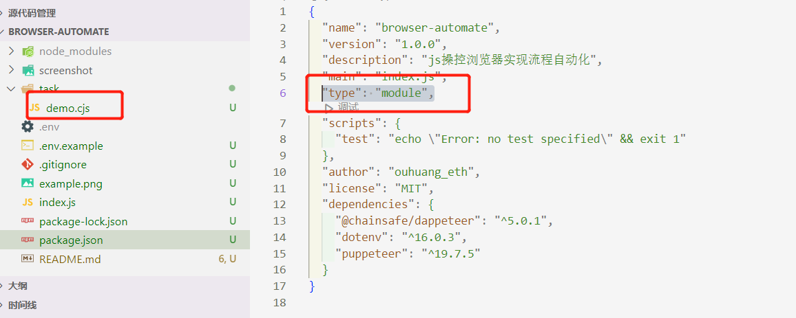

## js操作浏览器实现dapp交互自动化

目前使用js操作浏览器完成人工模拟操作最头疼的地方是和metamask钱包的交互，很多关键地方需要使用js钱包进行签名、交易。而与小狐狸交互就成了
整个环节中最繁琐的部分。

## 解决方案
在使用puppeteer操作浏览器的基础上，再引入@chainsafe/dappeteer这个依赖。dappeteer这个库封装了在无头浏览器中对metamask的常用操作。
可以说给puppeteer加了层buff。再配合puppeteer是chrome的亲儿子，在google浏览器的dev模式中直接就提供了脚本导出功能。珠联璧合，双管齐下，
使得自动化流程的编写变得极为简单。

Puppeteer 是一个 Node 库，它提供了一个高级 API 来通过 DevTools 协议控制 Chromium 或 Chrome。Puppeteer 默认以 headless 模式运行，但是可以通过修改配置文件运行“有头”模式。

## 开始教程

### 创建项目
你可以直接clone本项目，然后在我的基础上修改即可。无需在创建工程上花费太多时间。
拉取完成后，使用`npm i`安装项目所需依赖,安装完成后使用`node .\task\demo.cjs`运行，运行成功你将得到一张百度首页截图。

【注意】当你安装`npm i puppeteer`时，它会下载最新版本的Chromium（~170MB Mac，~282MB Linux，~280MB Win），以保证可以使用 API。 如果想要跳过下载，可用`npm i puppeteer-core`,puppeteer-core 是一个的轻量级的 Puppeteer 版本，用于启动现有浏览器安装或连接到远程安装。
### 编写脚本
【注意】如果你要使用在js中使用require模式进行引入，那么你需要将package.json中的type改为module，并且将js后缀名改为cjs。
```
const puppeteer = require('puppeteer');
```
